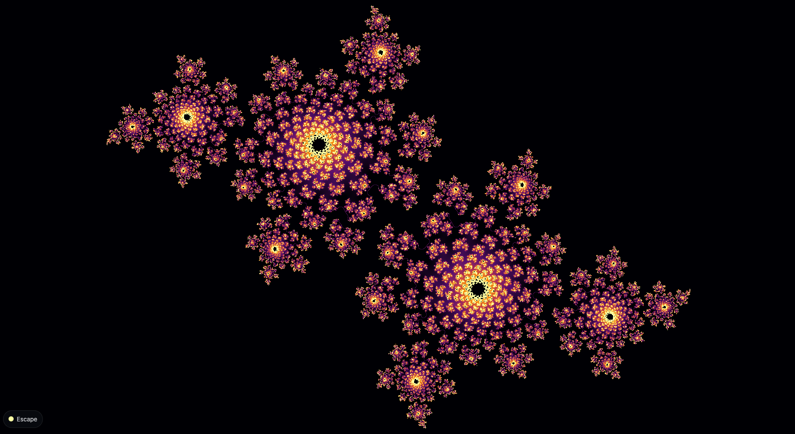

# Emergence lab

     

> Many agents following simple local rules produce what we call *emergent
> behaviour*, seen in everything from ecosystems to economies. 
>
> This is a working bench for multi-agent orchestration across
> Claude and Codex. The higher tier models plan and orcestrate lower tiers code and verify with clear boundries. Cross family orchestration, coding and verification improves outcomes and catches failure modes that are missed with a single model, at more than twice the cost...

 *[Emergent behaviour from nature to management theory](https://anthonywest.co.uk/research/emergent-behaviour-cross-domain)*.  



## The twelve

Twelve deterministic kernels behind one renderer. Each is a different  
discipline's way of pointing at the same thing: local rules, global form.

- **Gray-Scott** reaction diffusion. Chemistry's version of the question.
- **Abelian sandpile.** Self-organised criticality in one toy.
- **Conway's Game of Life.** The original, and still the cleanest.
- **Belousov-Zhabotinsky** waves. The reaction that taught chemistry about excitable media.
- **Boids.** Flocking from three local rules.
- **Lorenz attractor.** Where deterministic equations stop being predictable.
- **Diffusion-limited aggregation.** How dendrites and lightning agree.
- **Elementary cellular automata.** Wolfram's one-dimensional zoo.
- **Brian's Brain.** Three states. Somehow it breathes.
- **Mandelbrot, Julia, Burning Ship.** Iterated maps as the geometry of feedback.

Gray-Scott is the priority kernel. The others are calibrated and held.

## Run it

```bash
npm install
npm run dev
```

Open the URL Vite prints, normally `http://localhost:5173/`.

Checks:

```bash
npm run verify   # types, kernel tests, production build
npm test
npm run build
```

## Stack

Vite and TypeScript throughout. Kernels are pure deterministic numerics  
with no runtime dependencies. The renderer is moving to a quality-first  
WebGL2/GPU path, with Canvas 2D kept as a fallback and debug surface.  
Legacy browsers are not a target.

## Adding a simulation

1. Extend the `SimKernel` contract in [`docs/INTERFACE.md`](docs/INTERFACE.md) if the new sim needs it.
2. Add the kernel under `src/sims/<name>/` and wire the gallery in `src/app/**`.
3. Write the essay in `essays/<name>.md`.

Code is Codex-led under `src/**`. Architecture, the kernel contract, and  
the per-sim essays are Claude-led. The reasoning behind the split is in  
[`MODELS.md`](MODELS.md).

## Repository layout

```
emergence-lab/
  src/                    # kernels, renderer, controls, gallery
    sims/<name>/kernel.ts # deterministic kernel
    app/                  # renderer, gallery, controls, presets
  essays/                 # one .md per sim
  docs/
    INTERFACE.md          # the SimKernel contract
    PUBLISH-WORKFLOW.md   # publish-safety hooks and remotes
  HANDOFF.md              # current state and next-run brief
```

## Publish and secrets

The public branch tracks a clean history. Pre-commit and pre-push hooks  
are armed against personal paths and against pushing private branches to  
the public remote. The full workflow is in  
[`docs/PUBLISH-WORKFLOW.md`](docs/PUBLISH-WORKFLOW.md).

Secrets live in `.env.local`, gitignored. Never commit them.
