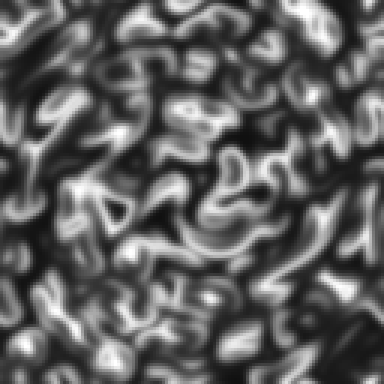
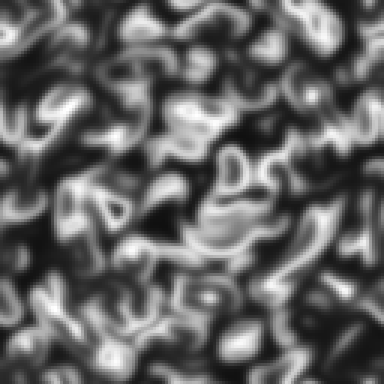
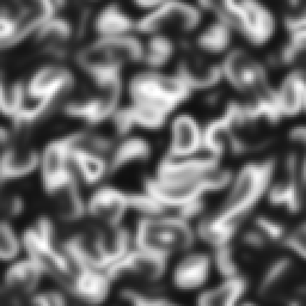
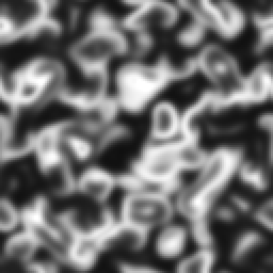

# Belousov–Zhabotinsky interestingness sweep — 2026-08-23

Generated by the Playwright interestingness-sweep harness (`e2e/`). Run it with:

```bash
SWEEP=1 npx playwright test sweep.spec.ts -g "sweep belousov"
```

Artifacts land under `e2e/artifacts/belousov-zhabotinsky/` (git-ignored). The
config is `BELOUSOV_ZHABOTINSKY` in `e2e/harness/sims.ts`. Metric stack
unchanged — see `docs/sweeps/gray-scott-interestingness.md`.

## Harness settings

128×128 grid, channel 0 (Activator), 400 warmup steps (spirals need ~300 to
organise out of the seed), flux gap 8.

**Coverage threshold 0.5, not the 0.1 used for Gray-Scott.** The activator is
nonzero across nearly the whole medium, so at 0.1 the harness reports coverage
0.973 and the composite's coverageFactor reads that as a saturated field,
collapsing every score to ≈0.17 regardless of what the medium is doing. At 0.5
the threshold separates wavefront from trough, coverage lands in 0.12–0.55, and
the ranking is carried by structure and detail as intended. This is a per-sim
lens setting of the kind the harness already has (Gray-Scott 0.1, boids 0.001),
not a change to the metric.

## Coverage of the search

- **Sets evaluated: 40** — feed ∈ linspace(0.008, 0.05, 8) × kill ∈ {0.008,
  0.016, 0.024, 0.032, 0.044}.
- **References evaluated: 3** — the shipped presets, unmodified.
- **Sets skipped: 120.** The unbudgeted grid is feed at 16 × kill at 10 over the
  same ranges (160 sets).
- **Not searched at all: 4 params** — `diffusionA`, `diffusionB`, `diffusionC`,
  `stepsPerFrame`. The three diffusion rates set front width and spiral pitch,
  and the shipped presets differ in all three, so the sweep ranks these presets
  only on their feed/kill placement.

The kill axis deliberately brackets 0.04 rather than running to the slider
maximum of 0.12: the kernel's own note records that damping above ~0.04
collapses the medium to a fixed point, and there is no point spending two thirds
of the budget confirming a dead zone.

## Ranking

| | set | score | entropy | autocorr | flux | coverage |
|---|---|---|---|---|---|---|
| 1 | feed 0.026, kill 0.024 | **0.952** | 0.97 | 0.94 | 0.2450 | 0.548 |
| 2 | feed 0.014, kill 0.016 | 0.952 | 0.96 | 0.94 | 0.1913 | 0.393 |
| 3 | feed 0.044, kill 0.032 | 0.948 | 0.96 | 0.94 | 0.2767 | 0.507 |

| reference | score | entropy | autocorr | flux | coverage |
|---|---|---|---|---|---|
| Fast catalyst | 0.941 | 0.92 | 0.96 | 0.3279 | 0.385 |
| Spiral waves | 0.931 | 0.92 | 0.94 | 0.2027 | 0.294 |
| Soft rings | 0.875 | 0.77 | 0.96 | 0.0863 | 0.120 |

## Reading

**No promotion is warranted.** The top swept set beats the best incumbent by
0.011 (1.2%) — inside the range where the metric is not a reliable guide to which
frame a person would prefer, and well short of the kind of delta that justified
the Gray-Scott and Clifford promotions (0.07–0.5).

Placed against the 40 swept sets, the incumbents rank: **Fast catalyst 6th,
Spiral waves 12th, Soft rings 34th.** The first two are where you want an
already-tuned preset to sit. Soft rings is genuinely in the bottom fifth, and it
is weakest on coverage (0.120, right at the lower edge of the coverageFactor
plateau) and flux (0.0863) — a quiet, low-contrast preset, which is what its name
promises. Not promoted: replacing it with a high-scoring set would delete the one
restrained option in the gallery, and the composite is known to under-rank
sparse-but-coherent frames.

The sweep also located the dead zone more precisely than the kernel's own note
does. It is a feed/kill **ratio** boundary, not a kill threshold: at kill 0.044
the medium is dead at feed 0.008 and 0.014 (both exactly 0.000) and barely alive
at feed 0.02 (0.023), but perfectly healthy at feed 0.026 and above (0.803–0.926).
The medium collapses when damping outruns replenishment, not whenever damping is
high. All three shipped presets sit at kill ≤ 0.03 with ample feed, well clear of
it.

## Promotion

None. The margin over the incumbents is too small to act on.

---

# Appendix — diffusion sweep, 2026-09-06

The 2026-08-23 sweep above held `diffusionA`, `diffusionB` and `diffusionC`
fixed at the Spiral waves values and ranked the three shipped presets on their
feed/kill placement alone, even though the presets differ in all three
diffusion rates. This appendix searches those three. Run it with:

```bash
SWEEP=1 npx playwright test sweep.spec.ts -g "sweep belousov"
```

which now runs two tests: the original feed/kill sweep and
`sweep belousov-zhabotinsky diffusion line`. The config is
`BELOUSOV_ZHABOTINSKY_DIFFUSION` in `e2e/harness/sims.ts` — a second entry
against the same slug, so the feed/kill sweep and its ranking are untouched.
Artifacts land under `e2e/artifacts/belousov-zhabotinsky-diffusion/`.

Every lens setting is copied from the feed/kill config unchanged: 128×128,
channel 0, 400 warmup steps, flux gap 8, coverage threshold 0.5. Metric stack,
weights and composite are untouched. Feed and kill are pinned at the Spiral
waves values (0.02 / 0.02) for all twelve sets, and `stepsPerFrame` stays at 1
(out of scope — it is a speed control).

## The line, and why it is not the line the card asked for

**The three shipped presets are not collinear in (A, B, C).** The two segments
disagree in the catalyst rate:

| segment | ΔA | ΔB | ΔC |
|---|---:|---:|---:|
| Soft rings → Spiral waves | +0.04 | +0.02 | **−0.020** |
| Spiral waves → Fast catalyst | +0.06 | +0.03 | **+0.045** |

A and B move in a fixed 2:1 ratio across both segments; C reverses. No straight
line passes through all three triples, so the design cannot be the one the
stage card assumed, and the substitute is stated here rather than glossed.

What *is* exactly true is that all three presets' **(A, B) projections lie on
one line**, to the last digit:

```
B = A/2 − 0.01      0.14→0.06 (Soft rings)   0.18→0.08 (Spiral waves)   0.24→0.11 (Fast catalyst)
```

That is the sweep's spine. Ten sets walk it in A from 0.06 to 0.34 — beyond
both outer presets, up to the activator slider's 0.35 ceiling — at Spiral
waves' catalyst rate C = 0.035, so the spine passes exactly through Spiral
waves' full triple and through the other two presets' (A, B). The remaining
two sets are the off-line probes, and they go in the one direction the spine
cannot reach: the other two presets' catalyst rates, C = 0.055 (Soft rings) and
C = 0.08 (Fast catalyst), at Spiral waves' own (A, B). C is therefore searched
as an independent axis at one point on the spine rather than dragged along it,
which is the only honest way to search a parameter the presets disagree about.

Twelve sets, listed here in line order. The three references are the shipped
presets with their own unmodified params, re-scored in this same run.

## Ranking

| rank | A | B | C | score | entropy | autocorr | flux | coverage |
|---:|---:|---:|---:|---:|---:|---:|---:|---:|
| 12 | 0.06 | 0.02 | 0.035 | 0.879 | 0.96 | 0.81 | 0.1957 | 0.395 |
| 11 | 0.09 | 0.035 | 0.035 | 0.903 | 0.94 | 0.87 | 0.1904 | 0.336 |
| 10 | 0.12 | 0.05 | 0.035 | 0.913 | 0.93 | 0.90 | 0.1914 | 0.297 |
| 9 | 0.14 | 0.06 | 0.035 | 0.918 | 0.92 | 0.91 | 0.1965 | 0.288 |
| 8 | 0.18 | 0.08 | 0.035 | 0.931 | 0.92 | 0.94 | 0.2027 | 0.294 |
| 7 | 0.18 | 0.08 | 0.055 | 0.936 | 0.93 | 0.94 | 0.2040 | 0.304 |
| 5 | 0.18 | 0.08 | 0.08 | **0.942** | 0.93 | 0.95 | 0.2063 | 0.319 |
| 6 | 0.21 | 0.095 | 0.035 | 0.942 | 0.93 | 0.95 | 0.2064 | 0.318 |
| 4 | 0.24 | 0.11 | 0.035 | 0.950 | 0.94 | 0.96 | 0.2134 | 0.347 |
| 3 | 0.27 | 0.125 | 0.035 | 0.957 | 0.95 | 0.96 | 0.2199 | 0.375 |
| 2 | 0.30 | 0.14 | 0.035 | 0.962 | 0.95 | 0.97 | 0.2268 | 0.392 |
| 1 | 0.34 | 0.16 | 0.035 | **0.967** | 0.96 | 0.97 | 0.2363 | 0.407 |

The two bold rows are the off-line probe at C = 0.08 (rank 5) and the top set
(rank 1). Rows 5 and 6 are a genuine tie at three decimals; rank 5 wins at
0.9417 against 0.9416.

| reference | score | entropy | autocorr | flux | coverage |
|---|---:|---:|---:|---:|---:|
| Fast catalyst | 0.941 | 0.92 | 0.96 | 0.3279 | 0.385 |
| Spiral waves | 0.931 | 0.92 | 0.94 | 0.2027 | 0.294 |
| Soft rings | 0.875 | 0.77 | 0.96 | 0.0863 | 0.120 |

**The three references reproduce the 2026-08-23 figures exactly** — not to three
decimals but bit-for-bit: 0.9308081945379483, 0.8746268563174677,
0.940553399396508, identical in both runs of this session. Nothing but the
diffusion triple moved. A second internal check falls out of the design: the
spine's A = 0.18 set is Spiral waves' full triple at Spiral waves' feed/kill,
and it scores the same 0.9308081945379483 as the reference, so the sweep path
and the reference path agree on the same point.

## Reading

**Do the presets rank differently on diffusion than on feed/kill?** No — the
order is the same, Fast catalyst > Spiral waves > Soft rings on both axes
(0.950 / 0.931 / 0.918 for their (A, B) at common feed/kill, against 0.941 /
0.931 / 0.875 in the feed/kill sweep), but the spread across the presets more
than halves, from 0.066 to 0.032, so their diffusion placement separates them
about half as much as their feed/kill placement does.

**Which single triple does the composite prefer at Spiral waves' feed/kill?**
(A 0.34, B 0.16, C 0.035), score 0.967.

**The score is monotone in A across the whole spine and peaks at its far end.**
0.879 → 0.967 with no interior optimum: the sweep did not find a preferred
front width, it found that the composite always wants a wider one, and stopped
because the activator slider ends at 0.35. Almost all of the ramp is
spatial autocorrelation (0.81 → 0.97, the only term that rises monotonically
with the score); entropy and coverage are U-shaped in A with their minima at
A = 0.14, and flux dips before it climbs (0.1957 at A = 0.06, a minimum of
0.1904 at 0.09, 0.2363 at 0.34). Wider fronts are a
smoother field, and a smoother field is what the autocorrelation term rewards —
which is the same direction the kernel's own param note describes as blur
("higher values blur the spiral and target-pattern fronts into softer, wider
bands"). Treat the high-A end as a metric artefact until someone looks at it.

**The catalyst rate barely matters.** Across its full shipped range at fixed
(A, B) = (0.18, 0.08), C moves the score by 0.011 — 0.931 → 0.936 → 0.942 —
against 0.088 for A/B along the spine. It is monotone increasing and in the
same direction as A, and it lands the C = 0.08 probe in a tie with an on-spine
set two steps up the line. Of the three rates the feed/kill sweep held fixed,
two do the work and one is close to a free parameter at this feed/kill.

## Promotion

**None.**

The top set beats Spiral waves' incumbent triple by 0.036 (3.9%) and the best
incumbent, Fast catalyst, by 0.026 (2.8%). That is larger than the 0.011 margin
the feed/kill sweep produced, but still well short of the 0.07–0.5 deltas that
justified the Gray-Scott and Clifford promotions, and it is the wrong shape to
act on: the ranking is a monotone ramp that runs to the edge of the parameter's
own slider, carried almost entirely by an autocorrelation term that rewards
exactly the blur the parameter's documentation warns about. A promotion here
would be promoting the metric's known bias, not a frame anyone chose. The
correct follow-up is a browser look at the A ≥ 0.27 end — its own card, with a
visual check — not a preset change on this evidence.

---

# Appendix — the high-activator end, looked at, 2026-09-07

The diffusion appendix above found the composite monotone in the activator rate
across its whole spine, 0.879 at A = 0.06 to 0.967 at A = 0.34, with no interior
optimum, and declined to promote on the grounds that the ramp was probably the
autocorrelation term rewarding the blur the kernel's own parameter note warns
about. It ended: "Treat the high-A end as a metric artefact until someone looks
at it." This appendix is the looking. No preset, metric, weight or threshold is
changed by it.

## How the four frames were captured

Four frames, at A = 0.18 (the shipped **Spiral waves** value), 0.24, 0.27 and
0.35 (the activator slider's ceiling). Everything else is identical across all
four:

| | value |
|---|---|
| feed / kill | 0.02 / 0.02 — Spiral waves', unmodified |
| diffusionB / diffusionC | 0.08 / 0.035 — Spiral waves', unmodified |
| stepsPerFrame | 1 |
| grid | 128 × 128, periodic |
| channel | 0, Activator |
| **step count** | **400 `step()` calls**, dt 1 — the diffusion sweep's warmup |
| colourmap | 8-bit grayscale, 0 → black, 1 → white, no gamma or contrast |
| upscale | 3× nearest-neighbour, so each frame is 384 × 384 |

**On the seed.** There is no seed number to quote, and that is the strongest
thing that can be said about reproducibility here.
`BelousovZhabotinskyKernel.seedSpatialPattern()` is a closed-form function of
`(x, y, width, height)` with no random source anywhere in the kernel and no
dependence on any parameter, so all four frames start from a bit-identical
initial field and the kernel is deterministic thereafter. Same params plus same
step count gives the same field, byte for byte, on any machine.

They were produced through the existing headless sweep driver
(`e2e/harness/driver.ts`) in a single browser session, written with
`encodeGrayscalePng` from `e2e/harness/report.ts` — the same path and the same
grayscale convention as the three Gray-Scott frames in the 2026-09-03
labyrinth appendix. `e2e/harness/sims.ts` is untouched: no sweep set was added,
because these are four captures rather than a search.

**These four walk A alone; the sweep's spine walked A and B together**
(B = A/2 − 0.01). The card asked for four frames differing in the activator
rate and nothing else, which is the cleaner attribution, so B is pinned at
Spiral waves' 0.08 throughout. The two axes agree to within 0.006 of composite
score at every point, so the frames are a faithful stand-in for the ramp they
are being used to adjudicate:

| A | score, A alone (B = 0.08) | score, on the spine (B = A/2 − 0.01) |
|---:|---:|---:|
| 0.18 | 0.9308 | 0.9308 — the same point; Spiral waves' full triple |
| 0.24 | 0.9448 | 0.9499 |
| 0.27 | 0.9501 | 0.9569 |
| 0.34 | — | 0.9666 |
| 0.35 | 0.9620 | 0.9674 |

The A = 0.18 row reproduces the Spiral waves reference score from both earlier
runs exactly, which is the check that this capture session and the sweep are
looking at the same medium.

## The four frames

| A = 0.18 (shipped) | A = 0.24 |
|---|---|
|  |  |

| A = 0.27 | A = 0.35 (slider maximum) |
|---|---|
|  |  |

## A better picture, or a softer one? A coarser one

They are not indistinguishable — the escalation clause does not fire. Set the
first and last side by side and the difference is obvious. But the difference is
not the one the word "blur" predicts, and getting that right is the whole value
of having looked.

At 400 steps the activator field at Spiral waves' feed/kill is a **labyrinth of
worm-like fronts**, bright ridges separated by black troughs, filling the frame
edge to edge. All four frames are that same picture. What changes along the ramp
is its **scale**, and almost nothing else:

| A | score | autocorr | mean front spacing | mid-band, \|v−0.5\| < 0.1 | deep dark, v < 0.15 | bright, v > 0.85 | std dev |
|---:|---:|---:|---:|---:|---:|---:|---:|
| 0.18 | 0.9308 | 0.937 | 10.5 px | 0.221 | 0.147 | 0.032 | 0.222 |
| 0.24 | 0.9448 | 0.953 | 11.7 px | 0.217 | 0.152 | 0.034 | 0.231 |
| 0.27 | 0.9501 | 0.959 | 12.2 px | 0.216 | 0.155 | 0.038 | 0.237 |
| 0.35 | 0.9620 | 0.968 | 13.5 px | 0.224 | 0.168 | 0.060 | 0.250 |

Front spacing is the frame width divided by the mean number of 0.5-threshold
crossings per scanline, averaged over rows and columns — a direct read of how
many fronts fit across the picture.

**Front width: fronts widen by 28% across the ramp**, 10.5 px to 13.5 px at a
fixed 128-cell grid. Equivalently, about twelve fronts cross the frame at
A = 0.18 and about nine and a half at A = 0.35. Every large-scale shape in the
0.18 frame is still recognisably present in the 0.35 frame; it has simply been
drawn with a fatter brush, and the small hooks, stubs and single-cell curls that
crowd the 0.18 frame have been absorbed into their neighbours.

**Contrast: it does not fall. It rises slightly.** This is where the word "blur"
misleads. Real blur pushes intensities towards the middle of the range; here the
fraction of the frame sitting in the ambiguous mid-band is flat at 0.216–0.224
across the whole ramp, the deep-black fraction grows from 0.147 to 0.168, the
saturated-bright fraction nearly doubles from 0.032 to 0.060, and the standard
deviation climbs from 0.222 to 0.250. Each individual front is *better* resolved
at A = 0.35 than at A = 0.18 — wider, with a flatter bright plateau in the
middle and a black trough on each side. What is lost is not edge definition but
**feature count**. It is not a washout. It is a zoom-in.

**Spiral pitch and spiral cores.** Neither can be judged from these four frames,
and saying so is more useful than inventing an answer. At 128 cells and 400
steps the medium has no visible spiral or target core at *any* of the four A
values, including the shipped one — the seeded ring geometry has already broken
up into the labyrinth described above, and there is nothing rotating in shot to
lose. Driven longer (1200 and 3000 steps) and wider (256²) the picture does not
change character: still a labyrinth at both ends of the range, still coarser at
0.35, with the composite settling at 0.943 for A = 0.18 and 0.954–0.956 for
A = 0.35 — the same ordering by the same margin.

The organised waves the preset is named for appear at the **app's own** scale,
not the harness's, and there the answer is clear. Loading `#/belousov-zhabotinsky`
in the running app at a 1280 × 720 canvas with these two parameter sets and
letting each reach ~700 iterations gives, at A = 0.18, a dense system of
concentric target rings around an off-centre core with fine beading along every
front; at A = 0.35, the **same ring system, with the cores intact**, at a wider
ring pitch, fewer rings across the frame, and bolder strokes. The cores survive.
The beading survives. The picture opens up. Repeat it by setting
`localStorage["el:values:belousov-zhabotinsky"]` to the triple in the table above
before navigating to the route; the two live captures behind this paragraph were
scratch, and are not committed.

## The verdict on 0.967: it is the structure term rewarding coarseness

**The 0.967 is not reading a real improvement.** It is reading feature size, and
it would read the same rise for any operation that made the fronts wider.

The case is in the two middle columns of the table above. Spatial
autocorrelation as this harness computes it is Moran's-I at **lag 1** — the
covariance between each cell and the neighbour immediately right and immediately
below it, over the field variance. Lag 1 is one grid cell. When the mean front
spacing goes from 10.5 cells to 13.5 cells, a larger share of every
cell's immediate neighbourhood necessarily lies inside the same front, and the
lag-1 correlation must rise. It does, monotonically and in lockstep: 10.5 px →
0.937, 11.7 → 0.953, 12.2 → 0.959, 13.5 → 0.968. At a fixed grid this term is a
**scale meter**, not a structure meter, and A is the one shipped parameter that
moves scale directly. The ramp runs to the end of the slider because the term
has no interior optimum to find: there is no feature width it prefers, only
"wider".

Two things follow, and the second is the reason to state this carefully. First,
stage 81's instinct was right and its promotion decision was right: the ramp is
an artefact of the instrument. Second, its diagnosis was half wrong, and
repeating it unexamined would have put a false claim in the record — the field
at A = 0.35 is not blurred, washed out, or low-contrast, and anyone who rejects
the high-A end expecting to see mush will not see mush. The metric is not
rewarding a *degraded* picture. It is rewarding a *coarser* one and calling
coarseness structure, which is a subtler failure and a harder one to catch by
looking at a single frame.

**Which frame I would ship: A = 0.18, the incumbent.** Not because 0.35 is bad —
at the app's own scale it is a perfectly good picture and a bolder one — but
because the shipped value packs more incident into the same frame, and a gallery
entry is looked at for a few seconds. Fine beading and a tight ring cadence read
as more going on; the wide-pitch version reads as the same thing, larger. If the
gallery wanted a deliberately open, bold BZ variant, A ≈ 0.30–0.35 is where to
get it, and that is a design decision about the set, not a score to chase. On
the evidence of the composite alone there is no reason to move: the 0.036 the
score offers is 0.036 of coarseness.

## Promotion

**None.**

Confirmed against the frames, and for a sharper reason than the diffusion
appendix could give. The 0.036 margin the A = 0.34 set holds over Spiral waves
is a measurement of front width in cells, not of anything a viewer would call an
improvement, and promoting it would move the shipped preset to the edge of a
slider in the direction the instrument is biased. The three shipped presets stay
as they are. `src/app/presets.ts` is unchanged by this stage.

**Escalation, for card 83 and not acted on here.** The lag-1 spatial
autocorrelation term is scale-dependent by construction, so at a fixed grid it
scores any monotone widening of a field's features as a monotone gain in
structure. That behaviour is not confined to this sim: it applies to every field
sim the harness scores, and it means the composite systematically prefers the
coarse end of any diffusion-like parameter. The `multiLagStructure` reading
already implemented in `e2e/harness/metrics.ts` but deliberately kept out of the
composite is the obvious instrument to compare it against. Whether the term
should be changed is out of scope for this card, which changes no metric, weight,
threshold or composite.
