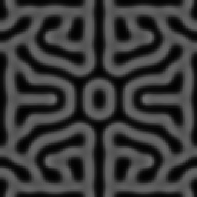
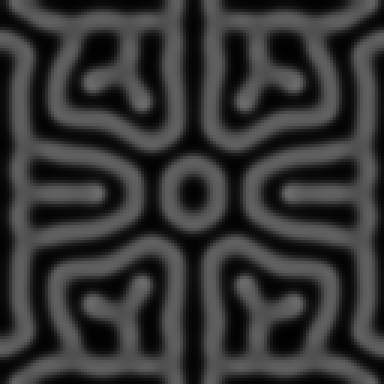
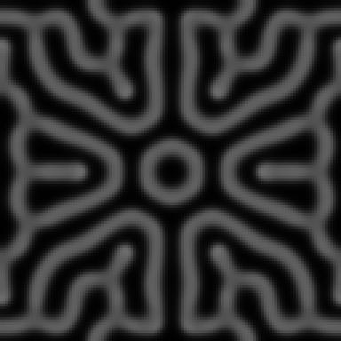

# Gray-Scott interestingness sweep — results & promoted presets

Generated by the Playwright interestingness-sweep harness (`e2e/`). Run it with:

```bash
SWEEP=1 npx playwright test sweep.spec.ts -g "gray-scott"
```

Artifacts (per-candidate grayscale field PNGs, full ranked JSON, a generated
report) land under `e2e/artifacts/gray-scott/` (git-ignored).

> Historical note (2026-07-16): the score tables below were captured with the
> former raw square seed. The live kernel now generates a single approximate
> warm-start wave, so fresh absolute scores are not directly comparable.

## How the harness scores a frame

The sweep drives the **real kernel** headlessly through the Vite dev server: it
imports `src/app/registry.ts` in the page, constructs a fresh `GrayScottKernel`,
injects an F/k parameter set, steps it deterministically (128×128 grid, 700
`step()` calls ≈ 14 000 Euler iterations so the regime fully develops), and reads
the `V` channel back as a float field. It scores that field — not the rendered
pixels — because the field is the deterministic ground truth the renderer merely
colours: same params + same step count ⇒ identical field ⇒ identical score, with
no dependence on colour map, GPU, or frame timing.

Four metrics, combined into one composite (see `e2e/harness/metrics.ts`):

- **entropy** — Shannon entropy of the intensity histogram (rich vs flat).
- **spatial autocorrelation** — Moran's-I-style coherence (structure vs noise).
- **temporal flux** — mean per-cell change between two frames (alive vs frozen).
- **coverage** — fraction of the field above background (fills space vs empty).

`score = coverageFactor · (0.55·structure + 0.45·detail) · liveliness`, where
`coverageFactor` plateaus for coverage in ≈[0.12, 0.85] and falls to 0 for an
empty or saturated field, and `liveliness` is a gentle flux bonus (floor 0.85).

## Result: two existing presets were measurably broken/weak

| Preset (regime) | F | k | score | note |
|---|---|---|---|---|
| **Waves** — *old* | 0.014 | 0.045 | **0.000** | renders a **dead, empty field** — V decays everywhere |
| **Waves** — *promoted* | 0.018 | 0.0487 | **0.831** | full field of large pulsing cells; the actual travelling-wave regime |
| **Spots** — *old* | 0.030 | 0.062 | **0.669** | sparse dots with an empty centre |
| **Spots** — *promoted* | 0.026 | 0.0597 | **0.743** | dense hexagonal lattice that fills the frame |

Reference scores for unchanged presets (same run, for context): Default/Coral
0.722, Maze 0.695, Mitosis 0.661.

### Waves: 0.000 → 0.831 (defect fix)

`F=0.014, k=0.045` sits just inside the dying zone of the Pearson map, so the V
species washes out to a uniform empty field — the "Waves" preset showed *nothing*.
The genuine travelling-wave / soliton regime is slightly higher: `F=0.018,
k=0.0487` was the top-scoring set in the whole sweep (0.831), a frame-filling
pattern of large rounded cells that keeps moving (temporal flux 0.118 — the
highest of any developed regime). This is the single biggest delta in the sweep
and fixes a preset that was effectively broken.

### Spots: 0.669 → 0.743 (+11%)

The old Spots regime leaves the centre and margins sparse. Dropping the kill rate
(`k 0.062 → 0.0597`) and feed (`F 0.030 → 0.026`) yields a denser, regular
hexagonal dot lattice that fills the whole field — visibly fuller and a clean
+0.074 on the composite, the same "spots" identity done better.

Both regimes are stable steady-state Turing patterns at 14 000 iterations (the
Spots lattice is quasi-static, flux 0.013), so they are safe as shipped presets
and qualitatively grid-size independent (the Turing wavelength is set by the
diffusion ratio, not the grid).

## Notes / honest limitations of the metric

- The composite is a **ranking aid, not an oracle** — the final aesthetic call is
  a human/Opus judgement made by eyeballing the field PNGs the harness emits. It
  mildly over-rewards *sparse but coherent* frames (e.g. a single labyrinth
  "flower" on black scores ~0.71 on high autocorrelation despite being mostly
  empty). Coverage-gating limits this but does not eliminate it.
- **Seed symmetry.** Every Gray-Scott regime is 4/8-fold symmetric because the
  kernel generates one central warm-start wave in a symmetric, periodic domain.
  The sweep frames remain mandala-like; this is faithful to the live sim's
  behaviour, just smaller and earlier.

## Lorenz & Boids (swept, not promoted)

- **Lorenz** (`-g lorenz`): higher rho (~37–42) with a long fade (0.997) draws the
  full layered butterfly (score ≈0.60–0.63), whereas the classic `rho=28`
  app-default reads as a thin one-wing trace (0.174) — the trajectory lingers on
  one wing and the short trail decays before both light up. No promotion was made:
  `rho=28` is the canonical Lorenz value and the existing **Wide wings** preset
  (`rho=35`) already renders the full butterfly. A single snapshot of a
  trajectory sim is also timing-sensitive; a multi-snapshot average would score
  Lorenz more robustly. Filed as future work.

  > **Closed — stage `67-lorenz-multi-snapshot-scoring`, completed
  > 2026-08-30T22:14:53Z, commit `2a5b388` (reconciled 2026-09-02, stage
  > `74-sweep-write-ups-record-what-landed`).** See "Appendix: Lorenz
  > multi-snapshot scoring — 2026-08-30" below.
- **Boids** (`-g boids`): the occupancy-field lens is the wrong instrument for a
  sparse swarm — all sets score ≈0.02 because binary point-density on a 200²
  grid carries almost no spatial-autocorrelation signal. Flocking "interest"
  lives in **velocity coherence** (the kernel's vx/vy channels 2–3), not occupancy
  texture. A polarisation/order-parameter metric on the velocity channels is the
  right follow-up before tuning Boids by measurement.

  > **Closed — stage `63-point-cloud-metrics`, completed
  > 2026-09-01T18:59:14Z, commit `2bf4c47` (reconciled 2026-09-02, stage
  > `74-sweep-write-ups-record-what-landed`).** Both the smoothed-density
  > point-cloud instrument and per-set velocity coherence were built and
  > wired to Boids. See `docs/sweeps/boids-interestingness.md` (new file,
  > this stage).

## Appendix: Lorenz multi-snapshot scoring — 2026-08-30

The Lorenz sweep now opts into **N=5** deterministic frame pairs, with frame A
captured after **280, 420, 560, 700, and 840** kernel steps and frame B eight
steps later. Every position starts from a fresh kernel. The harness reports the
mean plus min, max, and population standard deviation for every metric; sims
without this opt-in retain the original single-pair result shape and execution
path.

| set | single score at step 280 | N=5 mean | min–max | std dev |
|---|---:|---:|---:|---:|
| rho=28, sigma=10, fade=0.992, steps/frame=6 | 0.610012 | 0.595079 | 0.577254–0.610012 | 0.010529 |
| rho=35, sigma=10, fade=0.990, steps/frame=12 | 0.677307 | 0.678021 | 0.672011–0.686087 | 0.005620 |
| rho=37, sigma=10, fade=0.997, steps/frame=6 | 0.685512 | 0.684172 | 0.679966–0.690644 | 0.003716 |
| rho=42, sigma=10, fade=0.997, steps/frame=6 | 0.687707 | 0.700738 | 0.687707–0.708288 | 0.006968 |

The score spread is small: 0.004–0.011 standard deviation, and averaging moves
the four single-frame readings by −0.015, +0.001, −0.001, and +0.013. The live
headless harness no longer reproduces the historical rho=28 score of 0.174
recorded above; at the same configured step 280 it now produces 0.610012. On
the current kernel, timing noise therefore does not explain a large ranking
gap. Multi-snapshot scoring is still the more robust trajectory measurement,
but it does not change the preset conclusion: canonical rho=28 stays, and the
existing **Wide wings** rho=35 preset already covers the fuller butterfly. No
preset was changed.

On this machine the four-set headless measurement completed in 3.96 seconds
including browser and dev-server startup. Individual single-pair drives took
75–115 ms; their five-snapshot counterparts took 405–446 ms, about 3.7–5.7×
the wall-clock cost.

Clifford–De Jong remains on single-pair scoring: its coefficients are pinned,
its 260-step warmup is already about 2.6 trail-decay convergence times, and the
documented sensitivity is saturation/framing rather than trajectory timing.
DLA also remains single-pair: its seed is pinned and its 500-step scoring point
is a terminal cluster state with exactly zero flux, so later snapshots would be
identical rather than a timing sample.

## Appendix: multi-lag structure term cross-check — 2026-08-30

Stage 66 added `multiLagSpatialAutocorrelation` (`e2e/harness/metrics.ts`), a
generalisation of the existing lag-1 spatial autocorrelation across lags
{1, 2, 3, 4, 6, 8} that reports the strongest reading found at any of them. Full
write-up and the Game of Life rescue case are in
`docs/sweeps/game-of-life-interestingness.md`.

Re-running Default (Coral) reproduced the composite's recorded contract-test
values exactly: entropy 0.6967874006572629, spatial autocorrelation
0.9369885340278952, coverage 0.6756591796875, temporal flux
0.0011477361467768787, score 0.7102674508287455 — confirming acceptance
criterion 3, the composite path is untouched by this card.

| reference | lag-1 (existing) | multi-lag (new) | disagreement |
|---|---:|---:|---|
| Default (Coral) | 0.9370 | 0.9370 | none |
| Mitosis | 0.9489 | 0.9489 | none |
| Maze | 0.9392 | 0.9392 | none |

None. Gray-Scott's Turing patterns are smoothly-varying reaction-diffusion
textures with a wavelength well above 1-2 cells, so the lag-1 term already
reads them near-maximally and the wider lag set finds nothing stronger — same
result as the Ising cross-check above. Across all three sims checked for this
card (Game of Life, Ising, Gray-Scott), the new term only disagrees with the
old one on the one case it was built for: Game of Life's "Maze-like" preset.

## Appendix: U-skate gliders retired — 2026-09-02

The shipped **U-skate gliders** preset (`F=0.062, k=0.0609`) rendered a
near-uniform mid-grey field with a handful of small dark dots. It has been
removed from `src/app/presets.ts`; Gray-Scott now ships six presets. This
appendix records the measurement that retired it, because the parameter pair is
the canonical one from the literature and will look correct to the next reader
who checks it against a reference.


*Left: the retired preset. Right: Coral, for scale. Both are the sweep's own
artefact — the V field at 128×128 after 700 `step()` calls, grayscale, 3×
nearest-neighbour upscale. Left is not a low-scoring pattern; it is the absence
of one.*

### Before and after

| preset | F | k | score | entropy | autocorr | coverage | flux |
|---|---:|---:|---:|---:|---:|---:|---:|
| U-skate gliders (retired) | 0.062 | 0.0609 | **0.200813** | 0.3753 | 0.9303 | 0.9485 | 0.001534 |
| Coral (Default) | 0.0545 | 0.062 | 0.710267 | 0.6968 | 0.9370 | 0.6757 | 0.001148 |
| Worms | 0.054 | 0.063 | 0.708718 | 0.6910 | 0.9411 | 0.6080 | 0.000900 |
| Maze | 0.029 | 0.057 | 0.689690 | 0.6488 | 0.9392 | 0.6573 | 0.000502 |
| Mitosis | 0.0367 | 0.0649 | 0.652860 | 0.5350 | 0.9489 | 0.3113 | 0.001005 |
| Spots | 0.026 | 0.0597 | 0.741193 | 0.5260 | 0.9491 | 0.2766 | 0.031086 |
| Waves | 0.018 | 0.0487 | 0.796346 | 0.5806 | 0.9729 | 0.4063 | 0.148948 |

There is no "after" score, because there is no repaired preset: the search below
found nothing to repair it to. The other six presets are untouched and reproduce
the values above exactly (Coral to all sixteen digits of the figure the
contract test in `e2e/sweep.spec.ts` pins, `0.7102674508287455`).

Coverage 0.9485 is past the composite's ≈0.85 saturation edge and entropy 0.3753
is well below the 0.47–0.70 the survivors manage, so the composite is reading the
frame correctly. The instrument is not what was wrong.

### Which cause: the pair, not the seeding or the step budget

The two candidate explanations were a wrong or drifted F/k pair, and a right pair
that the seed geometry or step budget never lets develop. It is the pair, and the
pair has not drifted — `F=0.062, k=0.0609` is the canonical u-skate point from the
Gray-Scott literature, in the same non-dimensional units this kernel uses
(`Du/dx²·dt = 0.2097`). It was copied correctly and does not survive this
kernel's discretisation.

What the field actually does at that pair: it runs to a homogeneous steady state
and stops. The medium is bistable here, between an *empty* state (`U=1, V=0`, the
undepleted background every seed is dropped into) and a *filled* one. Solving the
reaction terms for `F=0.062, k=0.0609` puts the filled state at `U≈0.4199,
V≈0.2927`, and the whole field converges to exactly that — measured `V` median
0.293 by step 200, the dark dots being the few pinned holes left over from the
seed rings.

- **Not the step budget.** Coverage and flux are flat from step 2000 onwards:
  coverage 0.9623 at flux 1×10⁻⁵ at step 2000, then coverage 0.9620 at flux
  0.00000 from step 5000 all the way to step 40 000 (800 000 Euler iterations,
  57× the sweep's budget). Nothing further happens, ever.
- **Not the seeding.** Wiping to the empty state and painting a single 8×8 patch
  of V reproduces the same end state: the filled region invades outward without
  bound (coverage 0.0039 → 0.19 → 0.59 → 0.948 at steps 0/100/200/400) and
  freezes when it meets itself around the torus. A smaller 9×4 patch is below the
  critical nucleus and dies outright. Nothing between those two yields a bounded
  structure, because at this pair the empty→filled front has a positive velocity,
  which is exactly the condition under which an isolated soliton cannot exist. No
  seed geometry can outrun an invading front.
- **Not the sweep's grid either.** Same behaviour at every resolution, including
  the ones the live app runs at: coverage 0.813 / 0.948 / 0.959 / 0.907 / 0.915 at
  96², 128², 192², 256², 384², with flux ≤ 0.0016 at step 700 and ≤ 0.0004 at step
  2000 in every case, and the composite never above 0.69. The bigger grids take
  longer only because the front has further to travel before it closes; the end
  state is the same everywhere.

What a visitor actually saw is worth stating precisely, because it is not blank
from the first frame. Driving the live page (Playwright, WebGL2, the default
balanced grid) at `F=0.062, k=0.0609` shows an expanding disc with a busy,
decorated rim for the first few minutes — the invasion front crossing the grid,
and genuinely nice to look at. Then the front closes on itself, the interior is
the uniform filled state, and the sim stops changing for as long as it is left
running. That transient is a property of the saturating band, not of this pair in
particular, and it contains no travelling structures: the rim advances, nothing
crosses the field.

### What was searched

Two passes, both headless, both on the harness's own settings (V channel,
700 `step()` calls, coverage threshold 0.1, composite unchanged), with a
structure-tracking pass added on top: label the connected components of
`V > 0.2`, match them between frames 100 steps apart, and report how many
translated. Calibration on the shipped presets behaves as it should — Mitosis,
Coral, Maze and Worms register no translation, Waves and Spots do.

1. **The whole slider plane, 651 sets.** `F` ∈ [0.010, 0.070] step 0.002 × `k` ∈
   [0.040, 0.070] step 0.0015, at 96². Everything at `F ≥ 0.056` is dead,
   saturated, or a static labyrinth. The sets with translating structures are all
   at low feed, `F` ≈ 0.012–0.028 with `k` ≈ 0.049–0.060, plus a few weak cases
   beside Mitosis at `F` ≈ 0.036–0.038, `k = 0.0655`.
2. **The u-skate neighbourhood at full slider resolution, 210 sets.** `F` ∈
   [0.056, 0.066] × `k` ∈ [0.0590, 0.0635], both at step 0.0005 — that is *every
   pair the F and k sliders can express* in the box around the shipped point,
   scored at 128². 69 are alive at all; **none has a single translating
   structure.** The best of them is a frozen labyrinth: `F=0.0585, k=0.0635`
   scores 0.728 at flux 0.0052, and `F=0.062, k=0.0615` — 0.0006 above the
   shipped kill rate, the same feed — scores 0.727 at flux 0.0032. Those are the
   Coral/Worms regime under another name, not gliders.

The low-feed region from pass 1 was then checked for whether its motion persists
or is just the seed rings expanding. It persists: at `F=0.024, k=0.058` the
composite runs 0.751 at step 700 and 0.781 at step 5000, with 56 of 60 and 68 of
76 components displaced by 6–10 cells per 100 steps respectively. But following
individual structures over 480 steps shows they do not *travel*: mean path length
54–240 cells against mean net displacement 10–20 cells (straightness 0.04–0.26).
They split, merge and pulse in place. That regime is the travelling-wave and
self-replicating-spot family the shipped **Waves** (0.796) and **Spots** (0.741)
presets already occupy, so it offers no distinct preset even setting the name
aside.

### Result: a negative one, per the card's escalation

No pair reachable on this sim's sliders produces recognisable travelling gliders
at the resolution and step budget it ships with. The likely reason is
discretisation rather than parameters: u-skate solitons need more grid cells per
feature than this kernel can give them. Feature size in cells scales as √Du, and
`Du = 0.2097` is already 84% of the explicit-Euler stability ceiling (0.25 for
the five-point Laplacian at `dt = 1`), so it cannot be raised. Getting the
solitons would take a nine-point stencil or a smaller timestep — a kernel change
that moves every Gray-Scott preset, not a preset change.

Given that, the preset was retired rather than renamed. Renaming would have meant
shipping `F=0.062, k=0.0609` under an honest label, and the honest label for that
frame is "saturated washout", which is not worth a slot in the dropdown. Nothing
else changed: no other preset, no metric, no weight, no sweep setting.

Two things a future card could pick up, neither of them decided here:

- **The `F=0.062, k=0.0615` labyrinth (0.727).** A real pattern a hair above the
  retired kill rate, but static, and close enough to Coral (0.710) and Worms
  (0.709) that it would need a visual case for why the set needs a third of them.

  > **Closed — rejected, stage `75-gray-scott-labyrinth-preset`, 2026-09-03.**
  > Not promoted. The visual case does not hold and the pair is one `k` slider
  > tick from a dead field in both directions. See "Appendix: the 0.727
  > labyrinth rejected — 2026-09-03" below.
- **Gliders at a finer discretisation.** A nine-point Laplacian or a sub-unit
  timestep is the only route to the regime the retired preset was named for, and
  it is a kernel-wide decision with its own re-baseline attached.

  > **Closed — negative, stage `76-gray-scott-nine-point-laplacian`,
  > 2026-09-03.** A selectable nine-point Laplacian landed in the kernel behind
  > the five-point default. At the shipped grid and step budget it produces no
  > travelling structure at `F=0.062, k=0.0609` or at any of the 210 pairs in
  > this appendix's u-skate box; the default stencil and the six presets are
  > unchanged. See "Appendix: the nine-point stencil does not reach the glider
  > regime — 2026-09-03" below.

## Appendix: the 0.727 labyrinth rejected — 2026-09-03

Stage 73 left `F=0.062, k=0.0615` undecided: a real static labyrinth scoring
0.727, above Coral (0.710) and Worms (0.709), but close enough to both that it
needed a visual case before it could take a seventh slot in the Gray-Scott
dropdown. **It was rejected.** Gray-Scott continues to ship six presets, and
`src/app/presets.ts` is unchanged by this stage.

### The three frames

| candidate | Coral | Worms |
|---|---|---|
|  |  |  |

All three are the sweep's own artefact at the shipped `Du=0.2097`,
`Dv=0.105`, `stepsPerFrame=20`: the V field at 128×128 after 700 `step()`
calls, grayscale, 3× nearest-neighbour upscale. They were produced through the
headless sweep driver in one run, so nothing but F and k differs between them.

### What distinguishes it visually: line weight, and nothing else

The three frames are the same pattern at three points on one axis. Each is the
same radially-symmetric mandala the seed geometry imposes on every Gray-Scott
regime, drawn as bright ridges with black channels between them, and the only
thing that changes across the row is how much of the frame the bright phase
occupies:

| | Worms | Coral | candidate |
|---|---:|---:|---:|
| coverage | 0.6080 | 0.6757 | 0.7125 |

Worms is the sparsest — thin single filaments on wide black. Coral thickens
them into paired ridges. The candidate thickens them one notch further, until
the bright phase is the ground and the labyrinth reads as dark grooves cut
into it. That is a real difference and it is visible when the three are set
side by side, but it is a difference of degree along the axis Coral and Worms
already sample, not a third regime. Cycled one at a time through the dropdown
— which is how a visitor actually meets a preset — the step from Coral to the
candidate is a change of line weight in an otherwise identical picture. That
is the visual case the stage 73 note asked for, and it fails.

Its metrics say the same thing. Entropy 0.7112 and autocorrelation 0.9385
against Coral's 0.6968 and 0.9370: the composite separates them by 0.0167, and
what it is rewarding is the slightly larger coverage, which is exactly the
"one notch thicker" the picture shows.

### The stronger reason: it is one slider tick from a dead field

`k` on this sim's slider steps by 0.0005 (`paramSchema` in
`src/sims/gray-scott/kernel.ts`). Driving the neighbourhood headlessly at
`F=0.062`, at the harness's own settings, shows the candidate sitting on a
knife edge one tick wide:

| F | k | score | coverage | entropy | flux | what the field is |
|---:|---:|---:|---:|---:|---:|---|
| 0.062 | 0.0625 | **0.000** | 0.0000 | 0.0000 | 0.0000 | empty — the seed dies |
| 0.062 | 0.0620 | **0.000** | 0.0000 | 0.0000 | 0.0000 | empty — the seed dies |
| 0.062 | 0.0615 | **0.726955** | 0.7125 | 0.7112 | 0.003242 | the candidate |
| 0.062 | 0.0610 | **0.689081** | 0.8318 | 0.6592 | 0.000438 | near-saturated, frozen |
| 0.062 | 0.0605 | **0.000** | 1.0000 | 0.0000 | 0.0000 | uniformly filled — washout |

One tick up in `k` and the pattern does not exist; one tick down and coverage
runs to 0.832 at flux 0.0004, which is the saturated frozen field this sweep
retired **U-skate gliders** for two ticks earlier at `k=0.0609`; two ticks down
and the field is uniformly full, coverage 1.0, entropy zero. `F` is tolerant
here — `F=0.0615` and `F=0.0625` at the same `k` score 0.714 and 0.726, the
same pattern — so the fragility is entirely in `k`, and it is total.

A preset is a jump-off point: the visitor picks one and then moves the
sliders. Coral survives that treatment, and so do the other five. This pair
does not survive a single tick of the one slider a visitor is most likely to
touch, and the failure mode on the way down is the exact washout stage 73 just
removed from the dropdown. Shipping it would re-introduce that frame one click
away from a preset, under a name that promised a labyrinth.

### Result

Rejected. The score is real, the pattern is real, and neither is enough: it
adds a third sample of the Coral/Worms regime, distinguishable only by line
weight, at a parameter point that cannot be explored from. The six shipped
presets are untouched and reproduce their recorded scores exactly — Waves
0.796346, Spots 0.741193, Coral 0.710267, Worms 0.708718, Maze 0.689690,
Mitosis 0.652860, all measured again in this stage's own run. No metric,
weight, kernel or sweep setting changed.

Because nothing was promoted, no row was added to the sweep table. Every
number in this appendix was produced by this stage, headlessly, through the
sweep driver and `scoreFrames` at the Gray-Scott config's own settings (128×128,
700 `step()` calls, V channel, coverage threshold 0.1, `fluxGap` 12), driven
from a scratch spec under `npx playwright test`; the shipped equivalent for
reproducing the preset rows is:

```bash
SWEEP=1 npx playwright test sweep.spec.ts -g "gray-scott"
```

## Appendix: the nine-point stencil does not reach the glider regime — 2026-09-03

Stage 73 closed with one route left open to the regime the retired **U-skate
gliders** preset was named for: a finer discretisation, by a nine-point
Laplacian or a sub-unit timestep. This stage built the nine-point stencil and
asked it the question. **The answer is no.** At the shipped grid and step
budget, the nine-point stencil produces no travelling structure at
`F=0.062, k=0.0609` or at any of the 210 pairs in stage 73's u-skate box. The
default stencil stays five-point, the six shipped presets are untouched, and
`src/app/presets.ts` is unchanged by this stage.

### What landed in the kernel

`src/sims/gray-scott/kernel.ts` gains a `stencil` parameter, an enum with two
values, **`five-point`** (the default, the stencil every preset was tuned on)
and **`nine-point`**, the isotropic Patra–Karttunen stencil
`(4·edges + diagonals − 20·centre) / 6`. Both are second-order accurate; the
nine-point's leading error term is rotationally symmetric, so features stop
inheriting the grid's axes, and its spectral radius is 16/3 rather than 8, so
the explicit-Euler ceiling on `Du` rises from 0.25 to 0.375. The five-point
pass is the shipped loop moved verbatim into its own method; the arithmetic is
unchanged. It appears in the control panel as "Laplacian stencil" under
Reaction-diffusion, defaulting to five-point, and no preset sets it.

Two unit tests pin the relationship between the stencils
(`src/sims/gray-scott/kernel.test.cjs`). On a separable sine field
`sin(kx·x)·sin(ky·y)` painted onto the torus, the two Laplacians differ by
exactly `(2/3)(1 − cos kx)(1 − cos ky)` per unit amplitude, the O(h²k⁴)
truncation gap between them; the test measures that gap after one Euler step
at wavelengths 16 and 32 cells, requires it within 1% of the formula on both
channels, and requires the ratio between the two wavelengths to sit between 14
and 18, as a fourth-order term must (the analytic ratio is 15.7). A second test
checks that a uniform field stays uniform under either stencil, and a third
that the default, an unknown string, and a non-string all resolve to the
five-point result while `nine-point` does not.

### Nothing shipped changed: the six presets reproduce exactly

With the default stencil, all six shipped presets reproduce their recorded
scores to every digit through the shipped harness path (Playwright, headless,
`driveKernel` at 128×128, 700 `step()` calls, V channel, coverage threshold
0.1, `fluxGap` 12), in this stage's own run:

| preset | F | k | score (five-point, default) |
|---|---:|---:|---:|
| Waves | 0.018 | 0.0487 | 0.7963458726372294 |
| Spots | 0.026 | 0.0597 | 0.7411929696553551 |
| Coral (Default) | 0.0545 | 0.062 | 0.7102674508287455 |
| Worms | 0.054 | 0.063 | 0.7087181881369251 |
| Maze | 0.029 | 0.057 | 0.6896900329572433 |
| Mitosis | 0.0367 | 0.0649 | 0.6528595882826324 |

Coral matches the contract test's pinned value in `e2e/sweep.spec.ts`, whose
frozen assertion block is unmodified, and the five always-on harness tests
pass. The retired pair reproduces its stage 73 number too, 0.20081257385221984.

### The question: measured, and the answer is no

**The canonical pair under nine-point.** `F=0.062, k=0.0609` at the shipped
`Du=0.2097, Dv=0.105, stepsPerFrame=20`, 128×128, 700 `step()` calls:

| stencil | score | coverage | entropy | autocorr | flux | components (V > 0.2) |
|---|---:|---:|---:|---:|---:|---:|
| five-point | 0.200813 | 0.9485 | 0.3753 | 0.9303 | 0.001534 | 1 |
| nine-point | 0.153677 | 0.9587 | 0.3233 | 0.9244 | 0.000732 | 1 |

The same washout, slightly more complete. The frame is the near-uniform
filled state with the seed rings' pinned holes in it; one connected component
covers 96% of the field and does not move.

**The box under nine-point.** Every pair the sliders can express in
`F ∈ [0.056, 0.066] × k ∈ [0.0590, 0.0635]`, both at step 0.0005, 210 sets,
scored at the harness settings above and then tracked (measure below):

| | five-point (this stage's control) | nine-point |
|---|---:|---:|
| sets | 210 | 210 |
| alive at step 700 (0 < coverage < 1) | 69 | 74 |
| sets with a translating structure between step 700 and 800 | 0 | 0 |
| sets with a structure travelling ≥ 8 cells net over 480 steps | 0 | 0 |
| best straightness of any track | 0 | 0 |
| best score | 0.728 at F=0.0585, k=0.0635 | 0.720 at F=0.0595, k=0.062 |

The five-point column reproduces stage 73 exactly, 69 alive and the same best
pair at the same score, which is the check that this stage's re-implemented
measure and stage 73's agree on the box. Under nine-point the box has the
same shape: uniformly full at `k ≤ 0.0600`, dead at high `k` and high `F`, and
a band of static labyrinths between, at flux no higher than 0.0030 (five-point:
0.0052). The five extra nine-point survivors are all near-saturated fields,
coverage 0.85–1, in the `k = 0.0605` column on the flooded edge of the box;
the labyrinth band proper (coverage 0.12–0.85) is 58 sets under nine-point
against 63 under five-point. The nine-point best member, `F=0.0595, k=0.062`,
is two components at coverage 0.681 and flux 0.0016: the Coral regime, one
notch thicker, frozen. Nothing in either column translates; the highest-flux
living set in the nine-point box,
`F=0.059, k=0.0635`, is four components at flux 0.0030 with none of them
displaced.

**The measure**, re-implemented from stage 73's description because its
scratch code was never committed: label the 4-connected components of
`V > 0.2` on the torus with wrap-aware centroids; match components between
snapshots 20 `step()` calls apart by nearest centroid within 12 cells and a
size ratio within 0.5–2, one-to-one; a component has *translated* if its
centroid moved ≥ 3 cells between steps 700 and 800; a *track* follows one
component for 24 consecutive hops (480 `step()` calls from step 700), with
straightness = net displacement / path length, reported for tracks whose net
displacement is ≥ 8 cells so that pulsing in place cannot register. Calibrated
on the shipped presets under five-point it behaves as stage 73's did: Spots 8
of 22 matched components translated at 3.0 cells per 100 steps, stage 73's
low-feed set `F=0.024, k=0.058` 8 of 16 at 3.6 cells, and Mitosis, Coral,
Worms and Maze zero. Waves is the one difference: its fronts change shape
faster than a 20-step hop, so no component survives the matcher and it reads
as unmatched rather than static. That is a limit of this implementation, not
of stage 73's, and it cannot hide a glider in the box, where every living set
is matched hop to hop and none moves. The measure does see motion under the
new stencil when there is any: the same low-feed set under nine-point
registers 20 of 28 translated at 6.4 cells and four full tracks of
straightness 0.56.

The search stayed inside stage 73's box. Nothing outside it was scored.

### Why the stencil could never have answered yes

Stage 73 attributed the missing solitons to discretisation, on the reasoning
that feature size in cells scales as √Du and `Du = 0.2097` sits at 84% of the
five-point ceiling. The nine-point stencil lifts that ceiling, but at the
shipped `Du` it adds no cells per feature: it changes only how the diagonals
are weighted. Two facts follow, and both were measured.

First, the invasion that floods the canonical pair is the same under both
stencils. Stage 73's single-patch probe, repeated here under nine-point: wipe
the field to `U=1, V=0`, paint one 8×8 patch of `V`, run.

| stencil | coverage at step 0 | 100 | 200 | 400 | 700 |
|---|---:|---:|---:|---:|---:|
| five-point | 0.0039 | 0.1877 | 0.5911 | 0.9480 | 0.9585 |
| nine-point | 0.0039 | 0.1865 | 0.5876 | 0.9482 | 0.9595 |

The front crosses the field at the same speed to within 1%, and the
sub-critical 9×4 and 6×6 patches die under both. That is not a coincidence:
on a field that is constant along one axis, the nine-point stencil reduces
algebraically to the five-point one (`(6·left + 6·right − 12·centre) / 6`),
so a planar front has *identical* dynamics under both, and only curvature
corrections differ. The empty→filled front velocity that stage 73 identified
as the condition ruling out an isolated soliton is a one-dimensional
property, and the stencil cannot touch it.

Second, what the stencil does change is anisotropy, and that shows up where
it should: patterns are a little rounder, five of the six presets move their
coverage by under 0.025 in either direction, and the regime at every pair in
the box is the same. Waves, the one preset that moves more, is in the table
below.

The route that does add cells per feature is a larger `Du` in cell units,
which for explicit Euler means a sub-unit timestep, so that `Du·dt` stays
under the ceiling while `Du` itself grows: doubling the cells per feature
needs `Du ≈ 0.84`, four substeps of `dt = 0.25`, four times the compute for
the same physical time, and a 128×128 sweep grid that then holds a quarter as
many features. The card names that as the fallback for the case where the
stencil leaves the question open. It did not; the answer is no, and per the
card's escalation rule the sub-unit timestep was not built and not needed.
It remains the only discretisation route to the regime, and it is a kernel
change with its own cost and re-baseline, not a preset change.

### The six presets under nine-point, for the record

Not a re-baseline, because nothing is switched. These are the six presets
scored through the same browser path with `stencil: "nine-point"` and every
other parameter at its shipped value, recorded so that a future card that does
switch the default knows what it is walking into:

| preset | five-point score | nine-point score | Δ | five-point coverage | nine-point coverage |
|---|---:|---:|---:|---:|---:|
| Waves | 0.796346 | 0.835836 | +5.0% | 0.4063 | 0.6401 |
| Spots | 0.741193 | 0.757656 | +2.2% | 0.2766 | 0.2933 |
| Coral (Default) | 0.710267 | 0.706525 | −0.5% | 0.6757 | 0.6921 |
| Worms | 0.708718 | 0.705872 | −0.4% | 0.6080 | 0.6055 |
| Maze | 0.689690 | 0.694360 | +0.7% | 0.6573 | 0.6359 |
| Mitosis | 0.652860 | 0.657152 | +0.7% | 0.3113 | 0.3210 |

Five of the six move by under 2.5% and keep their character. **Waves is the
preset that would change character under a switch**: coverage rises from 0.41
to 0.64 and the frame goes from soft mottled fronts on black to crisp bright
rings, a different-looking picture at the same pair. That is the cost a
switching card would have to justify, and this stage has no reason to pay it.

### Result

Negative, and recorded. The nine-point stencil is in the kernel, selectable,
and off by default; the six shipped presets reproduce their recorded scores
exactly; no pair in stage 73's box or the canonical pair produces a travelling
structure under it; the default stays five-point. No preset was added,
changed or restored, no metric, weight or sweep setting changed, and no frame
was committed because there was no glider to commit. Every number in this
appendix was produced by this stage: the preset scores through the shipped
Playwright harness, and the box, the tracking and the patch probe in Node
against the compiled kernel (`.test-build/sims/gray-scott/kernel.js`, the same
code the unit tests run), which reproduces the harness's scores to the digit
on the pairs checked.

```bash
SWEEP=1 npx playwright test sweep.spec.ts -g "gray-scott"
```
